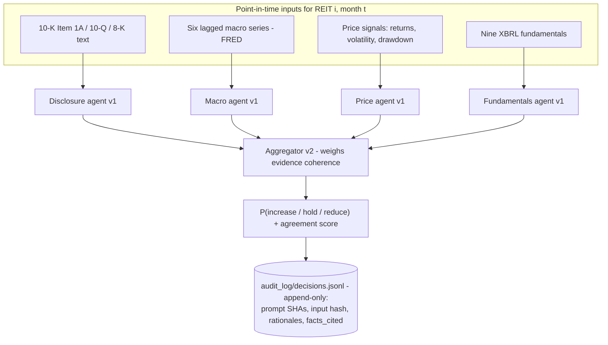
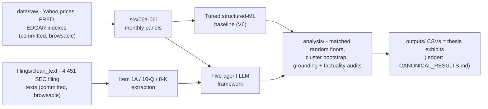

# An Auditable Multi-Agent LLM Framework for U.S. REIT Investment Decisions

**Can monthly downside risk in U.S. equity REITs be predicted at the firm level — and
does a five-agent LLM reading SEC disclosure beat a tuned, interpretable ML baseline?**
This is the complete replication package for an MPhil dissertation (Real Estate
Finance, University of Cambridge, 2026): all code, all data (raw layer browsable
right here in the repo), a 575-decision append-only audit log, and a
[step-by-step tutorial](TUTORIAL.md) that reproduces every headline number without an
API key. With your own API key, you can also run the framework live —
see [Run it live](#run-it-live-with-your-own-api-key).

## What this project does

Every month, for each of 25 large-cap U.S. equity REITs, the framework asks four
specialist LLM agents to read one slice of the evidence each — SEC risk-factor text,
the macro regime, price momentum, and XBRL fundamentals — and a fifth agent to
aggregate their probability views into a portfolio action (*increase / hold /
reduce*). Every decision is written to an append-only audit log with prompt hashes,
input hashes, and each agent's rationale and cited facts, so any decision can be
replayed and any claimed fact can be checked against its source filing.



Each agent returns strict JSON — probabilities, a rationale, and `facts_cited` that
must reference the provided inputs only. Prompts are SHA-locked
(`config/config.yaml`, verify with `make prompt_sha`); decoding is deterministic
(temperature 0, pinned model `deepseek-v4-flash`, ~$0.007 per decision at 2025
prices).

**A real decision from the audit log** (VTR, 2024-01-31 — final probabilities
increase 0.11 / hold 0.31 / **reduce 0.58**, agreement 0.85):

> **Disclosure agent** (sentiment: negative): *"The disclosure highlights persistent
> risks from labor cost inflation, occupancy challenges, and tenant concentration,
> with $92M in impairments year-to-date. While the new term loan adds liquidity, the
> overall risk profile remains negative…"*
>
> `facts_cited`: impairments of $72.7M in Q3 2023 and $92.0M for the nine months
> ended 2023-09-30 (10-Q Note 4); rising labor costs (10-K Item 1A); tenant
> concentration in Brookdale, Ardent, Kindred, Atria, Sunrise (10-Q Risk Factors).

## What we found (the honest part)

Across every specification and evaluation criterion tested, **no statistically or
economically meaningful predictive improvement**:

| Question | Result |
|---|---|
| Tuned logistic baseline: out-of-sample *reduce* recall | **0.000** |
| Five-agent framework: *reduce* recall vs a random floor at the same firing rate | **0.206 vs 0.204** |
| In-sample variation explained by calendar-month effects vs firm features (descriptive R²) | **0.43 vs 0.007** |

The null survives market-adjusted relabelling, a corrected disclosure feed, channel
ablations, and cluster-bootstrap inference. What *does* survive is auditable
diagnosis: cited fundamentals match the inputs exactly, 90.4% of disclosure numeric
tokens trace to the source filings, and an outcome-blind judge's entailment reading
is corroborated by two human raters, one of them independent. Every number
reconciles to [`CANONICAL_RESULTS.md`](CANONICAL_RESULTS.md).

## How the pieces fit



## Reproduce it (no API key needed)

**Follow [`TUTORIAL.md`](TUTORIAL.md)** — every command with its expected output,
tested end-to-end in a fresh clone. The condensed version:

```bash
git clone https://github.com/programming-thinker/auditable-reit-llm-framework.git
cd auditable-reit-llm-framework
gh release download v1.0-submission -p 'data.tar.gz' -p 'outputs.tar.gz' -p 'audit_log_local.tar.gz'
for f in *.tar.gz; do tar xzf "$f"; done
python3 -m venv .venv && source .venv/bin/activate
pip install -r requirements-lock.txt   # exact verified versions (requirements.txt also verified)
make reproduce_v6                      # golden-snapshot regression: PASSED = 6-dp match
make test                              # 61 passed
make prompt_sha                        # all five prompt hashes match the lock
```

Replaying the 575 logged LLM decisions into `predictions.csv` — and confirming they
match the shipped file — takes one more command (TUTORIAL Step 7).

## Run it live with your own API key

The pipeline is runnable end to end, not just replayable. The filing text the
Disclosure agent reads is already in the clone (`filings/clean_text/`), so after the
quick start above (the `data.tar.gz` extraction supplies the panels and filing
metadata), all that is left is the key:

```bash
cp .env.example .env    # edit .env and set BOTH lines:
                        #   DEEPSEEK_API_KEY=sk-...
                        #   DEEPSEEK_BASE_URL=https://api.deepseek.com
make llm_dev_run        # smoke test: 1 REIT x 2 months, ~$0.01-0.02
```

`make llm_dev_run` targets the pinned thesis model config `deepseek_v4_flash`
(override with `MODEL_CONFIG=`, options in `config/llm_model_configs.yaml`). Larger
runs: `make llm_validation` (25 REITs × 2022–2023); the full test window is
intentionally one-shot lock-guarded. Measured cost of the entire project's LLM usage:
about $11 for 1,549 ledgered decisions (`audit_log/cost_ledger.jsonl`) — roughly
$0.007 per five-agent decision. New decisions append to `audit_log/decisions.jsonl`
in the audited schema (`audit_log/SCHEMA.md`).

## The data

Two layers are **committed in this repository, browsable on GitHub**:

- [`data/raw/`](data/raw) — the raw market/macro layer: Yahoo daily prices
  (28 tickers incl. SPY/VNQ/XLRE benchmarks, 2015–2025), two FRED macro files, and
  25 EDGAR submission indexes. [`DATA.md`](DATA.md) lists all 29 files with sizes,
  row counts, and coverage, and documents the rebuild-from-raw chain (verified:
  raw → panels → `reproduce_v6` PASSED).
- [`filings/clean_text/`](filings/clean_text) — all 4,451 SEC filing text extracts
  (10-K/10-Q/8-K, 224 MB) that the Disclosure agent reads. (GitHub's folder view
  lists the first 1,000 files; the full inventory is
  `data/interim/filing_metadata.csv` inside `data.tar.gz`.)

Derived data and provenance ship as release assets on
[`v1.0-submission`](../../releases/tag/v1.0-submission):

| Asset | Size | Contents |
|---|---|---|
| `data_raw.tar.gz` | 2.8 MB | the committed raw layer, as one archive |
| `data.tar.gz` | 219 MB | full bundle: raw + interim + processed panels |
| `outputs.tar.gz` | 107 MB | every result CSV, golden snapshots, figures |
| `audit_log_local.tar.gz` | 1.1 MB | `decisions.jsonl` + `predictions.csv` of the main test run |
| `filings.tar.gz` | 291 MB | filing corpus incl. the 4.4 GB raw-HTML provenance layer behind the committed clean text |

## Repository map

| Path | Contents |
|---|---|
| `src/` | Structured-ML pipeline: panel construction, features, baseline estimation |
| `analysis/` | One script per thesis exhibit (tables, figures, bootstrap inference, audits) |
| `llm/` | Five-agent framework: agents, orchestrator, EDGAR client, post-processing |
| `data/raw/` | The raw data layer, committed and browsable (see `DATA.md`) |
| `filings/clean_text/` | 4,451 SEC filing text extracts the Disclosure agent reads, committed and browsable |
| `audit_log/` | Append-only decision evidence: schema, cost ledgers, masked-identity probe, corrected-feed rerun, human-rater materials |
| `config/` | REIT universe definition and the SHA-pinned prompt lock |
| `tests/` | Unit tests + the `reproduce_v6` golden-snapshot regression |
| `TUTORIAL.md` | Step-by-step reproduction walkthrough with expected outputs |
| `DATA.md` | Raw-data page: sources, file-by-file inventory, rebuild-from-raw |
| `SUPPLEMENT.md` | Thesis supplementary materials (Sections A–D) + how to reproduce each |
| `CANONICAL_RESULTS.md` | The single ledger every reported number traces to |
| `REPLICATION_GUIDE.md` | Exhibit-by-exhibit script/data map and full instructions |

The dissertation text itself is not distributed here before examination; its
supplementary materials are published in full as [`SUPPLEMENT.md`](SUPPLEMENT.md).

## Citation

Chen, L. (2026). *An Auditable Multi-Agent LLM Framework for U.S. REIT Investment
Decisions: Decomposable Rationales Beyond a Tuned Structured-ML Baseline* (MPhil
dissertation, University of Cambridge).
